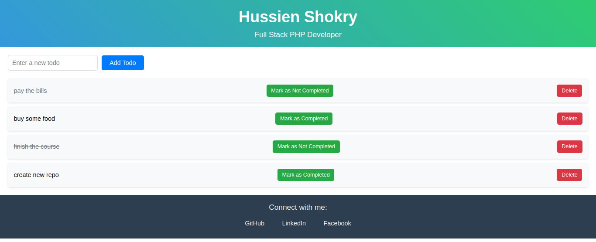

# TodoApp

A modern and intuitive Todo application built with Angular that helps you manage your tasks efficiently.



## Features

- Create, read, update, and delete todos
- Mark todos as completed
- Filter todos by status
- Clean and responsive user interface
- Data persistence using local storage

## Technologies Used

- Angular 18.1.3
- TypeScript
- HTML5/CSS3
- Bootstrap for styling

## Getting Started

1. Clone the repository
2. Install dependencies:
   ```bash
   npm install
   ```
3. Run the development server:
   ```bash
   ng serve
   ```
4. Navigate to `http://localhost:4200/`

## Development

- Run `ng generate component component-name` to generate a new component
- Run `ng build` to build the project
- Run `ng test` to execute unit tests via [Karma](https://karma-runner.github.io)
- Run `ng e2e` to execute end-to-end tests

## Project Structure

```
src/
├── app/
│   ├── components/    # Application components
│   ├── services/     # Services for data management
│   ├── models/       # TypeScript interfaces/types
│   └── pipes/        # Custom pipes
├── assets/          # Static assets
└── styles/         # Global styles
```

## Contributing

1. Fork the repository
2. Create a new branch
3. Make your changes
4. Submit a pull request

## Further Help

For more information about Angular CLI, use `ng help` or check out the [Angular CLI Overview and Command Reference](https://angular.dev/tools/cli) page.
